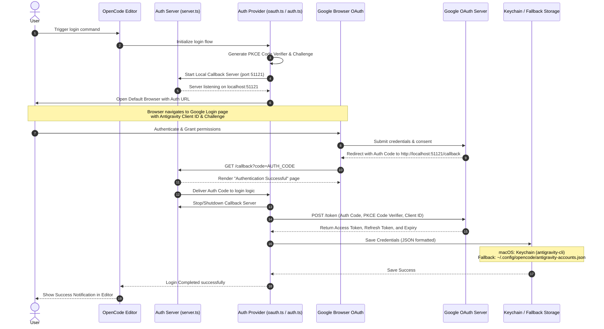

# Google Antigravity 2.0 Auth Provider for OpenCode

An unofficial, high-performance TypeScript/Node.js adapter to authenticate the **OpenCode** AI assistant against Google's internal **Antigravity 2.0 Unified Gateway** via OAuth. This provider intercepts generative AI requests and routes them through Antigravity Staging/Production endpoints, bypassing standard Google AI API billing limits and unlocking advanced thinking models.

---

## 🛠️ System Prerequisites

To build and run this auth provider, the host machine must have the following components installed and configured:

### 1. Operating System
*   **macOS** (13.0 Ventura, 14.0 Sonoma, or 15.0 Sequoia).
*   *Note:* The provider uses the native macOS `security` command line tool for credential storage. If running on Linux/Windows, it automatically falls back to secure file storage (`~/.config/opencode/antigravity-accounts.json` with `0o600` permissions).

### 2. Node.js & npm
*   **Node.js**: `v18.0.0` or higher (Required for native `globalThis.fetch` support).
*   **npm**: `v9.0.0` or higher.
*   Verify your local installation:
    ```bash
    node --version
    npm --version
    ```

### 3. Google Antigravity CLI (`agy`)
The official terminal client for Google's Antigravity AI platform is required to establish the baseline API client configuration, verify Google account permissions, and import settings.
*   **Installation (macOS / Linux):**
    ```bash
    curl -fsSL https://antigravity.google/cli/install.sh | bash
    ```
*   **PATH Configuration:**
    Ensure `~/.local/bin` is added to your shell's `PATH`. Add the following to your `~/.zshrc` or `~/.bashrc`:
    ```bash
    export PATH="$HOME/.local/bin:$PATH"
    ```
*   **Verification:**
    Ensure you can run the CLI tool and print the active client version:
    ```bash
    agy --version
    ```

---

## 📥 Project Installation & Build

Run the following instructions in OpenCode or your terminal to compile the provider plugin locally:

1.  **Clone the repository and enter the directory:**
    ```bash
    git clone https://github.com/minhgv/agy-auth-oc.git
    cd agy-auth-oc
    ```

2.  **Install development dependencies:**
    This project uses pure TypeScript with zero runtime third-party production dependencies.
    ```bash
    npm install
    ```

3.  **Compile TypeScript to ESM:**
    Generates Javascript code in the `/dist` directory.
    ```bash
    npm run build
    ```

4.  **Run Tests (Optional):**
    Verify the build and request interceptor logic with the Vitest test suite:
    ```bash
    npm run test
    ```

---

## 📂 Default Directories & Installation Paths

You can clone the `agy-auth-oc` repository to any workspace directory on your machine. The OpenCode config files and backup account files are resolved relative to the system's home directory.

Here is the path reference for macOS and Windows:

| Component | macOS / Linux Location | Windows Location |
| :--- | :--- | :--- |
| **Plugin Source (`agy-auth-oc`)** | *Any folder* (e.g. `~/plugins/agy-auth-oc`) | *Any folder* (e.g. `C:\plugins\agy-auth-oc`) |
| **OpenCode Config Directory** | `~/.config/opencode/` | `%USERPROFILE%\.config\opencode\` (equivalent to `C:\Users\<Name>\.config\opencode\`) |
| **OpenCode Config File** | `~/.config/opencode/opencode.json` | `%USERPROFILE%\.config\opencode\opencode.json` |
| **Fallback Accounts Storage** | `~/.config/opencode/antigravity-accounts.json` | `%USERPROFILE%\.config\opencode\antigravity-accounts.json` |
| **Keyring Storage** | macOS System Keychain (Service: `antigravity-cli`) | *Not Applicable* (uses fallback JSON storage with `0o600` permissions) |

### Path Resolution inside `opencode.json`
When registering the plugin in `opencode.json`, always provide the absolute path where you cloned the `agy-auth-oc` repository:
*   **macOS Example:** `/Users/<username>/plugins/agy-auth-oc`
*   **Windows Example:** `C:/Users/<username>/plugins/agy-auth-oc` *(Use forward slashes `/` in JSON configurations to avoid escape character errors)*

---

## 🔌 OpenCode Integration Setup

Register this compiled local package into OpenCode by modifying the primary OpenCode configurations.

### 1. Update OpenCode Plugin Config
Open `~/.config/opencode/opencode.json` (or your active profile configuration) and add the absolute file path of this plugin to your `plugins` block:

```json
{
  "plugins": [
    "/absolute/path/to/cloned/agy-auth-oc"
  ]
}
```

### 2. Configure Model Routing
Map the models you want to route through this provider in `~/.config/opencode/opencode.json`:

```json
{
  "provider": {
    "google": {
      "model": {
        "gemini-3.5-flash": "google/antigravity-gemini-3.5-flash",
        "gemini-3.5-pro": "google/antigravity-gemini-3.5-pro",
        "gemini-3-pro-high": "google/antigravity-gemini-3-pro-high",
        "claude-opus-4-6-thinking": "google/antigravity-claude-opus-4-6-thinking",
        "claude-sonnet-4-6": "google/antigravity-claude-sonnet-4-6"
      }
    }
  }
}
```

---

## 🔐 Google Account Authentication Flow

The plugin hosts a local callback listener on port `51121` to handle the PKCE OAuth exchange securely.

1.  **Initiate Login:**
    Run the login command from the project root directory:
    ```bash
    npm run login
    ```

2.  **Browser Consent:**
    Your default browser will open to Google's authentication page. Log in with your Google account.
    *   *Required Scopes:* `openid`, `email`, `profile`, `cloud-platform`, `experimentsandconfigs`, and `cclog`.

3.  **Token Storage:**
    After signing in, the local server at `http://localhost:51121/callback` exchanges the code for tokens and saves them:
    *   **Primary Store (macOS):** System Keychain (under Service: `antigravity-cli`, Account: `antigravity-auth-token`).
    *   **Backup / Non-macOS Fallback:** Saves to `~/.config/opencode/antigravity-accounts.json` with strict `0o600` read/write permissions.

4.  **Multi-Account Rotation (Optional):**
    Repeat the login step using secondary Google accounts to store multiple credential tokens. The plugin automatically rotates through active accounts. If one hits a rate-limit (HTTP `429` / Overage billing), the provider locks it for a cool-down period and shifts requests to the next account.

---

## 🔑 Antigravity Authentication Flow

The sequence diagram below details the Google OAuth 2.0 PKCE login process, starting a temporary local callback server, and securely storing credentials in the macOS Keychain or fallback JSON storage:



---

## 🔄 Operational & Interception Flow

The sequence diagram below represents how the plugin intercepts incoming calls from the OpenCode assistant, resolves credentials from the Keychain, and securely routes the translated payloads to the Google Antigravity Gateway:

```mermaid
sequenceDiagram
    autonumber
    actor User
    participant OC as OpenCode Editor
    participant FI as Fetch Interceptor (plugin.ts)
    participant AM as Account Manager (accounts.ts)
    participant KC as Keychain / Fallback Storage
    participant AG as Antigravity Gateway

    User->>OC: Submit Prompt / Trigger Chat
    Note over OC: Initiates fetch() call targeting<br/>generativelanguage.googleapis.com
    OC->>FI: Intercept fetch(url, options)
    
    rect rgb(30, 41, 59)
        Note over FI: 1. Sanitize JSON Schema (strip $ref, map const to enum)<br/>2. Normalize tool/function names<br/>3. Filter thinking blocks if needed
    end
    
    FI->>AM: getValidAccessToken()
    AM->>KC: Load saved credentials
    KC-->>AM: Return token (expiry, accessToken, refreshToken)
    
    alt Token is Expired
        AM->>AM: Refresh token via Google OAuth API
        AM->>KC: Save refreshed credentials
    end
    AM-->>FI: Return Valid Access Token

    FI->>FI: Translate payload to Antigravity v1internal format
    
    loop API Request Loop
        FI->>AG: POST /v1internal:streamGenerateChat (with Client Headers & Bearer Token)
        alt Success (HTTP 200)
            AG-->>FI: Stream SSE response chunks
        else Overage/Quota Error (HTTP 429 / 403 overage)
            Note over FI: Flag active account as rate-limited
            FI->>AM: Request next rotated account token
            AM-->>FI: Return secondary account token
            FI->>AG: Retry request with new token
        else Endpoint Failover
            Note over FI: Primary Gateway down -> Failover to Sandbox/Prod Gateways
            FI->>AG: Request alternative gateway endpoint
        end
    end
    
    loop Stream Processing
        FI->>FI: 1. Parse incoming SSE chunks<br/>2. Format search grounding citations<br/>3. Repair conversation turn boundaries (if needed)
        FI-->>OC: Stream transformed chunks in Google AI SDK format
    end
    
    OC-->>User: Render model response / text output
```



---

## ⚙️ Supported Models Reference

The internal Antigravity unified gateway supports the following routing targets:

| Model ID | Display Name | Context Window | Output Limit | Thinking Support |
| :--- | :--- | :--- | :--- | :--- |
| `gemini-3.5-flash` | Gemini 3.5 Flash | 1M tokens | 64k tokens | Yes (`minimal` level) |
| `gemini-3.5-pro` | Gemini 3.5 Pro | 1M tokens | 64k tokens | Yes (`medium` level) |
| `gemini-3-pro-high` | Gemini 3 Pro High | 1M tokens | 64k tokens | Yes (`high` level) |
| `gemini-3-pro-low` | Gemini 3 Pro Low | 1M tokens | 64k tokens | Yes (`low` level) |
| `claude-opus-4-6-thinking` | Claude Opus 4.6 | 200k tokens | 64k tokens | Yes (up to 32k budget) |
| `claude-sonnet-4-6` | Claude Sonnet 4.6 | 200k tokens | 64k tokens | No |

---

## 🔍 Troubleshooting & Verification

### Check Stored Keychain Credentials
To verify if macOS has successfully stored the credentials in your system keyring:
```bash
security find-generic-password -a "antigravity-auth-token" -s "antigravity-cli" -w
```
If it prints a valid JSON payload containing `accessToken` and `refreshToken`, the Keychain is working correctly.

### Check Fallback Account Storage
If Keychain access fails or is blocked, verify the fallback file contents and permissions:
```bash
ls -la ~/.config/opencode/antigravity-accounts.json
cat ~/.config/opencode/antigravity-accounts.json
```

### Port 51121 Conflict
If the login flow fails to bind to port `51121`, verify if another process is holding the port:
```bash
lsof -i :51121
```
Kill the conflicting process and retry the authentication flow.
